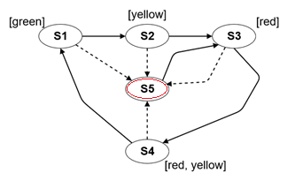

# 1. házi feladat - ANTLR

## A házi feladat elvégzésének lépései

1. A [kiinduló](https://github.com/MDSDLab/mdsd-2024-antlr-hw) repó tartalmát másoljuk be a saját repónkba, egy újonnan létrehozott **StateModel** mappába!
2. Oldjuk meg az alábbiakban leírt feladatot!
3. Készítsünk egy **hw1-antlr** nevű **tag**-et az utolsó commitra!

## A StateModel nyelv

Állapotok és átmeneteik leírásához alkottunk egy egyszerű modellt, melyhez szeretnénk egy saját, szöveges leíró nyelvet készíteni. A modellben csak állapotok és tranzíciók (átmenetek) szerepelhetnek. Az állapotokat címkékkel láthatjuk el. Az átmenetek sémáját nekünk kell létrehozni, egy séma hagyományos (normal) vagy hiba (error) típusú lehet. A modellnek mindig pontosan egy kezdőállapota van. Egy állapot szintén hagyományos (normal) vagy hiba (error) típusú lehet, de csak az utóbbit kell kiírnunk, az előbbi az alapértelmezett.

> **_Megjegyzés:_** A modell az ún. [Kripke struktúra](https://en.wikipedia.org/wiki/Kripke_structure_(model_checking)) egy kicsit átalakított változata. A modell szemantikája jelen házi feladat szempontjából nem fontos.

A nyelv a következőképpen épül fel:
* először az állapotokat kell megadnunk (*states* blokk)
    * egy állapot lehet kezdőállapot, ekkor ezt ki kell írnunk
    * egy állapot neve csak nagybetűt és számot tartalmazhat, és mindig nagybetűvel kezdődik
    * egy állapotnak akárhány címkéje lehet, ha egy sincs, egy üres blokkot akkor is ki kell írnunk
    * egy címke neve csak kisbetűt és számot tartalmazhat, és mindig kisbetűvel kezdődik
    * egy állapot lehet hagyományos és hiba típusú, ez utóbbit külön jeleznünk kell - a hagyományos típusút nem kell külön jelezni
* az állapotok megadása után az átmeneteket kell megadnunk (*transitions* blokk)
    * itt kétféle utasítást adhatunk meg, ezek tetszőleges sorrendben követhetik egymást, akár keverve is
    * az első fajta utasítás egy új átmenet sémát hoz létre: itt meg kell adnunk az átmenet típusát (*normal* vagy *error*), illetve a nevét
    * egy átmenet neve csak kisbetűt és számot tartalmazhat, és mindig kisbetűvel kezdődik
    * a második fajta utasítás egy konkrét átmenet megadása, itt meg kell adnunk az átmenet sémáját (amelyet valahol mi definiáltunk), valamint a kezdő és végállapotot (melyeket szintén mi definiáltuk)

A szintaxis kialakításánál használjuk a lent látható példakódot. A kód egy jelzőlámpa működését írja le, ahol *S5* egy hibás állapot. A könnyebb megértés érdekében a mellékelt ábra vizuálisan ábrázolja a modellt, de mi csak a szöveges nyelvvel foglalkozunk.

<br>


```
states {
    initial S1 {green}
    S2 {yellow}
    S3 {red}
    S4 {red, yellow}
    S5 { } error
}

transitions {
    trans normal n1     // define transitions between normal states
    n1: S1 -> S2
    n1: S2 -> S3
    n1: S3 -> S4
    n1: S4 -> S1

    trans normal n2     // define transitions from error to normal states
    n2: S5 -> S3

    trans error e       // define transitions from normal to error states
    e: S1 -> S5
    e: S2 -> S5
    e: S3 -> S5
    e: S4 -> S5
}
```

## A kiinduló projekt szerkezete

A *lib* mappa tartalmazza az ANTLR runtime jar-t, ami a futtatáshoz kell. Győződjünk meg róla, hogy ez hozzá van a projekt függőségeihez adva, az ANTLR gyakorlaton látott módon. Az *src* mappa *statemodel* package-je három fájlt tartalmaz:
* input.state: a bemeneti szöveget tartalmazza, a korábban említett jelzőlámpa modelljét írja le
* StateModel.g4: a nyelvtan fájl, csak ebben a fájlban dolgozzunk
    * **FONTOS:** állítsuk be a generált fájlok package-jét (nyelvtanon jobb klikk --> *Configure ANTLR* menüpont, ld. gyakorlat anyaga) a *statemodel.generated* package-re (a package nem létezik alapból, de létre fog jönni az első generáláskor), az output directory-t pedig a projekt src mappájára!
* StateModelRunner.java: az alkalmazás futtatásáért felelős, csak akkor működik, ha megfelelően beállítottuk a generálást

A *statemodel.exceptions* package hibakezeléssel kapcsolatos segédosztályokat tartalmaz, az ANTLR gyakorlathoz hasonló módon.

## Feladat

A házi feladat célja, hogy a fenti nyelv specifikációja alapján elkészüljön az azt leíró ANTLR nyelvtan (*StateModel.g4* fájl), valamint az ebből generált lexert és parsert futtatva (*StateModelRunner.java* osztály main függvénye) a megadott bemenetre (*input.state* fájl) hiba nélkül lefusson és teljesen feldolgozza azt. A bemeneti fájl tartalma a fejlesztés során szabadon módosítható, de beadáskor az eredeti szöveg szerepeljen benne! A kezdőszabály neve legyen *model*, vagy pedig módosítsuk a *StateModelRunner.java* fájl tartalmát: *ModelContext* --> *XYContext*, ahol XY a kezdőszabály neve!

> **_Megjegyzés:_** A szemantikai elemzés (és a későbbi fordítási fázisok) nem része a feladatnak. Tehát bizonyos követelményeket (pl. hogy mindig pontosan egy kezdőállapot lehet) nem kell ellenőrizni, a nyelvtanban sem kell ezeket semmilyen formában megoldani! A feladat része viszont ezeknek a felismerése, és ezek alapján a nyelvtan oly módon való megírása, hogy a nyelvtanból generált lexer és parser a kiadott bemeneti szöveget hibamentesen és teljesen képes legyen feldolgozni.

### Pontozás

A házi feladatra 0-2 pont szerezhető, a házi feladat legalább 1 pont elérésével sikeresnek minősül. A pontozás a következőképpen alakul:

| Megoldás minősége | Pontozás |
|--------------------------------------------------------------------|----------|
| A szöveg feldolgozása hibás vagy nem sikerül teljesen feldolgozni | 0 pont  |
| A szöveget sikerül hibamentesen és teljesen feldolgozni | 1 pont  |
| 1 pont elérve + a nyelvtan rugalmas, követi a gyakorlaton látott best practice megoldásokat | 2 pont  |


## Referenciák

Hasznos linkek a házi feladat elkészítéséhez:

* Az ANTLR gyakorlat [anyagai](https://github.com/bmeaut/ModellalapuSzoftverfejlesztes/tree/master/practice/practice_02)
    * IntelliJ és ANTLR technikai útmutatót is tartalmaz
* [ANTLR](https://www.antlr.org/) ([Dokumentáció](https://github.com/antlr/antlr4/blob/master/doc/index.md))
* [ANTLR példa nyelvtanok](https://github.com/antlr/grammars-v4)