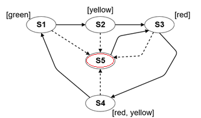

# Homework 1 - ANTLR

## Steps for completing the homework

1. Copy the contents of the [initial](https://github.com/MDSDLab/mdsd-2024-antlr-hw/) repo to your own repo, in a newly created **StateModel** folder!
2. Solve the task below!
3. Create a **tag** named **hw1-antlr** for the last commit!

## The StateModel language

We have created a simple model to describe states and their transitions, for which we would like to create our own textual language. Only states and transitions can be included in the model. The states can be assigned labels. Each transition is based on a transition scheme. A transition scheme is of normal or error type. The model always has exactly one initial state. A state can also be of normal or error type, in a similar way to transitions, but only the error type needs to be explicitly marked, normal being the default.

> **_Note:_** The model is a slightly modified version of the so-called [Kripke structure](https://en.wikipedia.org/wiki/Kripke_structure_(model_checking)). The semantics of the model are not relevant for this homework.

The language is structured as follows:
* state definitions (*states* block)
    * a state can be an initial state, in which case we have to explicitly indicate it
    * the name of a state can only contain capital letters and numbers and always starts with a capital letter
    * a state can have any number of labels, if there are none, an empty block must still be present
    * the name of a label can only contain lower case letters and numbers and always starts with a lower case letter
    * a state can be of normal and error type, the latter must be indicated separately - the normal type does not need to be indicated separately
* transition definitions (*transitions* block)
    * two types of statements can be defined here, in any order
    * the first statement type is defining a new transition scheme: we must specify the transition type (*normal* or *error*) and name
    * the second statement type is defining a transition: we must specify the transition scheme (referring by name to an element defined elsewhere) and the start and end states (referring by name to an element defined elsewhere)
    * the name of a transition and transition scheme can only contain lower case letters and numbers and always starts with a lower case letter

When developing the syntax of the language, use the example code below. The code describes the behavior of a traffic light where *S5* is an error state. For ease of understanding, the model is shown in the attached figure.

<br>


```
states {
    initial S1 {green}
    S2 {yellow}
    S3 {red}
    S4 {red, yellow}
    S5 { } error
}

transitions {
    trans normal n1     // define transitions between normal states
    n1: S1 -> S2
    n1: S2 -> S3
    n1: S3 -> S4
    n1: S4 -> S1

    trans normal n2     // define transitions from error to normal states
    n2: S5 -> S3

    trans error e       // define transitions from normal to error states
    e: S1 -> S5
    e: S2 -> S5
    e: S3 -> S5
    e: S4 -> S5
}
```

## Structure of the initial project

The *lib* folder contains the ANTLR runtime jar needed to run the application. Make sure this is added to the project dependencies, similarly to the practice materials. The *statemodel* package in the *src* folder contains three files:
* input.state: contains the input text, describing the model of the traffic light mentioned earlier
* StateModel.g4: the grammar file, we work only in this file
    * **IMPORTANT:** set the package of the generated files (right click in the grammar --> *Configure ANTLR*, see the practice materials) to the *statemodel.generated* package (the package does not exist by default, but will be created the first time the files are generated) and the output directory to the *src* folder of the project!
* StateModelRunner.java: responsible for running the application, contains errors until generation from the .g4 file has been set up

The *statemodel.exceptions* package contains helper classes for error handling, similarly to the practice materials.

## Task

The goal of the homework is to create an ANTLR grammar (*StateModel.g4* file) based on the above language specification and to run the lexer and parser generated from the grammar (main function of *StateModelRunner.java* class) on the given input (*input.state* file) without errors and process the text completely. The content of the input file can be freely modified during development, but it must contain the original text when submitted at the end! The name of the starting rule should be *model*, or otherwise modify the contents of the *StateModelRunner.java* file: *ModelContext* --> *XYContext*, where XY is the name of the starting rule!

> **Note:_** The semantic analysis (and subsequent compilation phases) is not part of the task. Thus, certain requirements (e.g. that there can always be exactly one initial state) do not need to be checked, nor do they need to be handled in any form in the grammar! However, it is part of the task to identify these problems and create the grammar accordingly so that the lexer and parser generated from the grammar can completely process the input text without errors.

### Scoring

The homework assignment is worth 0-2 points, and a homework assignment with a minimum of 1 point is considered successful. The scoring is as follows:

| Solution quality | Scoring |
|--------------------------------------------------------------------|----------|
| Processing the text is incorrect or fails to process it completely | 0 points |
| The text is processed correctly and completely | 1 point |
| 1 point achieved + the grammar is flexible and follows best practice solutions demonstrated in the practice materials | 2 points |


## References

Useful links for completing the homework:

* [ANTLR practice materials](https://github.com/bmeaut/ModellalapuSzoftverfejlesztes/tree/master/practice/practice_02)
    * Includes IntelliJ and ANTLR technical guide
* [ANTLR](https://www.antlr.org/) ([Documentation](https://github.com/antlr/antlr4/blob/master/doc/index.md))
* [ANTLR example grammars](https://github.com/antlr/grammars-v4)